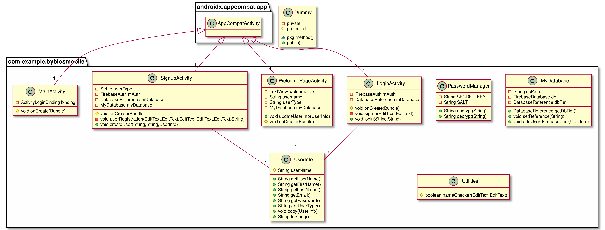

# SEG2105_F21 Project Group 43

| Projct SDK nfo       | Language Level (Java) |
|----------------------|-----------------------|
| Android API Level 31 | (SDK default) 11      |

# Group Members

| Name          | Student Number |
|---------------|----------------|
| Connor Bos    | 300011530      |
| Kurtis Yang   | 300125223      |
| Yichen Ye     | 300064549      |
| Yuxuan Wang   | 300116377      |
| Zarvaan Bacha | 300128068      |
- *alphabetical order*

Administrator account detials:
  Email: power@gmail.com
  Username: admin  
  Password: admin

# Deliverable 1

- [demo.mp4](./Javadoc/record.mp4)
- 

---

  | CHECK | Tasks                                                                                             | Weights |
  |-------|---------------------------------------------------------------------------------------------------|---------|
  |       | UML Class diagram of your domain model                                                            | 30      |
  |       | (-2 for each missing class)                                                                       |         |
  |       | (-2 for incorrect generalization)                                                                 |         |
  |       | (-0.5 for each incorrect multiplicity)                                                            |         |
  |       | (-0.5 for each missing attribute)                                                                 |         |
  |-------|---------------------------------------------------------------------------------------------------|---------|
  |       | Can create a Byblos branch employee account                                                       | 10      |
  |       | Can create a customer account                                                                     | 10      |
  |-------|---------------------------------------------------------------------------------------------------|---------|
  |       | Can see the ‘Welcome screen’ after successful authentication.                                     | 5       |
  |       | Can see the userInfo role                                                                         |         |
  |       | Can see the name or username associated to the account                                            |         |
  |-------|---------------------------------------------------------------------------------------------------|---------|
  |       | Fields are validated in all screens (e.g. you can’t enter an invalid email, name, etc)            | 10      |
  |       | (-1 for each field in which the userInfo input is not validated)                                  |         |
  |-------|---------------------------------------------------------------------------------------------------|---------|
  |       | APK submitted                                                                                     | 5       |
  |-------|---------------------------------------------------------------------------------------------------|---------|
  |       | Github: Each member of the group has made at least ONE commit to the repository.                  | 20      |
  |-------|---------------------------------------------------------------------------------------------------|---------|
  |       | Github: Repository created in Github contains all members of the group and userInfo wassimuottawa | 10      |
  |-------|---------------------------------------------------------------------------------------------------|---------|
  |       | OPTIONAL - Group uses a DB (e.g. Firebase or SQLITE, or other similar technology)                 | 5       |

---

